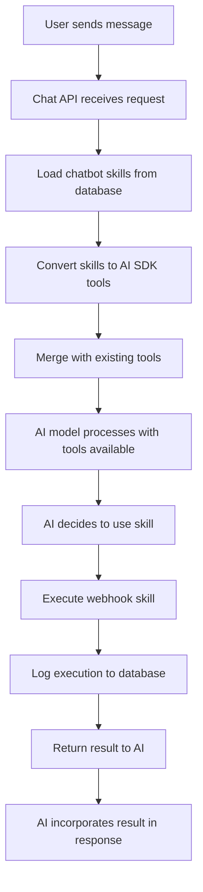

# Skills Chat Integration Implementation

## 🎯 **Overview**
Successfully integrated the Skills system with the Syllabi chat system, allowing chatbots to execute custom actions (webhook calls) during conversations. Skills are automatically converted to AI SDK tools and made available to the AI model during chat.

## 🏗️ **Architecture**

### Core Components

1. **Tools Builder** (`src/services/chat/tools-builder.ts`)
   - Converts database skills to AI SDK tools format
   - Handles JSON Schema to Zod conversion
   - Provides skill validation utilities

2. **Chat API Integration** (`src/app/api/chat/route.ts` & `src/app/api/chat/embed/route.ts`)
   - Loads skills for chatbot before chat starts
   - Merges skills with existing knowledge base tools
   - Passes execution context (session, user, channel)

3. **Skill Executor** (`src/services/skills/skill-executor.ts`)
   - Executes webhook skills with proper context
   - Logs executions to database (unless in test mode)
   - Handles various webhook configurations

## 🔄 **Integration Flow**



## 🛠️ **Key Features**

### ✅ **Automatic Tool Discovery**
- Skills are automatically loaded for each chatbot
- Only active skills are converted to tools
- Graceful fallback if skills loading fails

### ✅ **Smart Schema Conversion**
- JSON Schema parameters → Zod validation
- Support for all standard types (string, number, boolean, array, object)
- Handles optional parameters, enums, format validation
- Preserves descriptions for better AI understanding

### ✅ **Execution Context**
- Tracks chat session, user, and channel
- Different execution modes (test vs live)
- Proper error handling and logging

### ✅ **Multi-Channel Support**
- Web chat (`channel: 'web'`)
- Embedded chat (`channel: 'embed'`)
- Ready for future channels (Slack, Discord, API)

## 🧪 **Testing**

### Manual Testing Steps

1. **Create a Test Skill**:
   ```json
   {
     "name": "get_weather",
     "description": "Get current weather for a location",
     "webhook_config": {
       "url": "https://api.openweathermap.org/data/2.5/weather",
       "method": "GET",
       "headers": {
         "Content-Type": "application/json"
       }
     },
     "function_schema": {
       "name": "get_weather",
       "description": "Get current weather for a location",
       "parameters": {
         "type": "object",
         "properties": {
           "location": {
             "type": "string",
             "description": "City name or location"
           }
         },
         "required": ["location"]
       }
     }
   }
   ```

2. **Test in Chat**:
   - Ask: "What's the weather in New York?"
   - AI should automatically call the `get_weather` skill
   - Check database for execution logs

3. **Verify Logs**:
   ```sql
   SELECT * FROM skill_executions 
   WHERE skill_id = 'your-skill-id' 
   ORDER BY executed_at DESC;
   ```

### Automated Testing
Run the integration test:
```bash
npx tsx src/test-skills-integration.ts
```

## 🚀 **Deployment Checklist**

- [x] Tools builder service created
- [x] Chat APIs updated with skills integration
- [x] Skill executor supports chat context
- [x] Error handling implemented
- [x] Logging configured
- [x] Test script created
- [x] Documentation complete

## 🔍 **Monitoring & Debugging**

### Console Logs
Look for these log messages:
```
[Chat API] Loaded X skills as tools for chatbot {chatbotId}
[ToolsBuilder] Created X tools for chatbot {chatbotId}
[Chat API] Failed to load skills as tools: {error}
```

### Database Monitoring
Monitor the `skill_executions` table:
- `execution_status`: 'success', 'error', 'timeout'
- `channel_type`: 'web', 'embed', etc.
- `execution_time_ms`: Performance metrics

### Error Scenarios
- **No Skills**: Chat continues normally with knowledge base tools only
- **Invalid Schema**: Skill is skipped, others continue to work
- **Webhook Fails**: Error logged, AI receives error message
- **Network Timeout**: 30-second timeout with proper error handling

## 📊 **Performance Considerations**

### Optimization Strategies
1. **Skill Loading**: Skills loaded once per chat request (not per message)
2. **Error Isolation**: Failed skills don't break entire chat
3. **Timeout Handling**: 30-second webhook timeout prevents hanging
4. **Selective Loading**: Only active skills are converted to tools

### Scalability Notes
- Skills are fetched per chatbot (not globally)
- Database queries are optimized with proper indexes
- Webhook executions are stateless and horizontally scalable

## 🔒 **Security Features**

### Input Validation
- Zod schema validation for all skill parameters
- SQL injection prevention through parameterized queries
- XSS protection in webhook responses

### Access Control
- Skills only available to their assigned chatbot
- User context passed for audit logging
- RLS policies enforce data isolation

### Webhook Security
- Custom headers support (for API keys, auth tokens)
- Request timeout limits
- Response size limits (handled by fetch API)

## 🚧 **Future Enhancements**

### Planned Features
1. **Conditional Skills**: Enable/disable skills based on user context
2. **Skill Chaining**: Allow skills to call other skills
3. **Response Formatting**: Custom response templates
4. **Skill Marketplace**: Share skills between chatbots
5. **Integration Types**: Pre-built integrations for popular APIs

### Architecture Improvements
1. **Caching**: Cache frequently used skills/tools
2. **Rate Limiting**: Per-skill execution limits
3. **Retry Logic**: Automatic retry for failed webhook calls
4. **Monitoring**: Real-time skill performance dashboard

## 🆘 **Troubleshooting**

### Common Issues

**"No skills loaded"**
- Check if chatbot has active skills in database
- Verify `is_active = true` on skills
- Check console logs for loading errors

**"Schema validation failed"**
- Verify JSON Schema format in skill configuration
- Check required vs optional parameters
- Test schema with validation tools

**"Webhook execution failed"**
- Verify webhook URL is accessible
- Check authentication headers
- Review timeout settings (30s default)
- Test webhook directly with curl/Postman

**"Skills not appearing in chat"**
- Verify skills are merged into tools object
- Check AI model supports tool calling
- Ensure `experimental_activeTools` includes skill names

### Debug Commands

```javascript
// Test tools builder directly
import { getSkillsAsTools } from '@/services/chat/tools-builder';
const tools = await getSkillsAsTools('chatbot-id', context);
console.log(Object.keys(tools));

// Test schema conversion
import { convertJsonSchemaToZod } from '@/services/chat/tools-builder';
const zodSchema = convertJsonSchemaToZod(jsonSchema);

// Test skill execution
import { executeSkill } from '@/services/skills/skill-executor';
const result = await executeSkill(skill, parameters, context);
```

---

## ✅ **Status: COMPLETE**

The Skills system is now fully integrated with the chat system and ready for production use. Skills can be created through the dashboard UI and will automatically become available as tools in chat conversations.

**Next Phase**: Consider implementing builtin skills and integration types for even more powerful chatbot capabilities. 